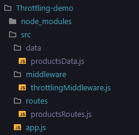

# Implementación del Patrón Cloud: Throttling

**Alumno:** Alonso Almerco  
**Curso:** Arquitectura de Software  
**Patrón:** Throttling Pattern  
**Proyecto grupal:** ERP para retail de artículos de campamento  

---

## 1. Problema

En sistemas distribuidos y aplicaciones web de alto tráfico, las solicitudes concurrentes sin control pueden **saturar el servidor**, provocando **caídas del sistema**, **degradación del rendimiento** y **mal uso de recursos**. Esto afecta especialmente a aplicaciones críticas como sistemas ERP, donde múltiples usuarios y módulos acceden simultáneamente a los mismos recursos.

En el caso del **ERP para retail de artículos de campamento**, durante períodos de alta demanda (como promociones o temporadas altas), el servidor puede recibir cientos de solicitudes simultáneas para consultar el catálogo de productos. Sin un mecanismo de control, esto puede:

- Saturar la capacidad de procesamiento del servidor.
- Generar tiempos de respuesta muy altos o timeouts.
- Provocar caídas del sistema completo.
- Afectar la experiencia de todos los usuarios.

**Problema principal:**  
> Las aplicaciones sin control de tráfico pueden colapsar ante picos de demanda, rechazando solicitudes legítimas o experimentando caídas completas del servicio.

---

## 2. Solución

El **patrón Throttling** (también conocido como *Rate Limiting*) propone **controlar la tasa de solicitudes** que un sistema puede procesar en un período determinado, protegiendo así el servidor de sobrecargas.

### Estrategia implementada:

A diferencia de los enfoques tradicionales que **rechazan** solicitudes cuando se excede el límite, esta implementación utiliza un enfoque más amigable:

1. El sistema **monitorea las solicitudes** por usuario/IP en una ventana de tiempo.
2. Si un usuario **excede el límite** configurado (ej. más de 3 solicitudes en 5 segundos):
   - **No rechaza** la solicitud.
   - En su lugar, **retrasa la respuesta** un tiempo configurado (ej. 3 segundos).
3. Las solicitudes dentro del límite se procesan **inmediatamente**.

### Características clave:

- **No hay rechazo de solicitudes:** todas son procesadas eventualmente.
- **Control de tráfico adaptativo:** protege el servidor sin penalizar excesivamente al usuario.
- **Transparencia:** el usuario recibe feedback sobre el retraso.
- **Logging detallado:** muestra en consola el flujo completo (recepción, retraso, envío).

### Ventajas principales

- Protección contra sobrecarga del servidor.
- Mejor distribución de recursos en picos de demanda.
- Experiencia de usuario mejorada (no hay rechazos HTTP 429).
- Sistema más resiliente y predecible.

### Tecnologías utilizadas

- **Node.js + Express:** backend para implementar el middleware de throttling.
- **JavaScript (ES6):** lógica del patrón con manejo de timestamps y delays.
- **In-memory tracking:** seguimiento de solicitudes por IP sin dependencias externas.

---

## 3. Casos de Aplicación

El patrón Throttling es crítico en cualquier sistema expuesto a tráfico variable o potenciales abusos:

- **APIs públicas:** para limitar llamadas por usuario/aplicación (ej. Twitter API, Google Maps API).
- **E-commerce:** durante Black Friday o Cyber Monday para evitar colapsos.
- **Sistemas bancarios:** para proteger endpoints críticos de transferencias o consultas.
- **Gaming online:** para prevenir spam de acciones o peticiones maliciosas.
- **IoT platforms:** para controlar el flujo de datos de millones de dispositivos.

**Ejemplo real:**  
- **GitHub API** implementa throttling con límites de 5,000 requests/hora para usuarios autenticados.
- **Stripe** usa rate limiting para proteger sus endpoints de pagos.
- **Cloudflare** ofrece throttling como servicio para proteger sitios web de tráfico excesivo.

---

## 4. Aplicación en el Proyecto ERP Retail

En el **ERP para retail de artículos de campamento**, el módulo de catálogo de productos implementa Throttling para:

- **Proteger el servidor** durante campañas promocionales.
- **Garantizar disponibilidad** para todos los usuarios.
- **Prevenir abusos** (scraping, bots, usuarios malintencionados).

### Configuración aplicada:

- **Máximo de solicitudes sin penalización:** 3 requests
- **Ventana de tiempo:** 5 segundos
- **Delay aplicado:** 3 segundos (si se excede el límite)

### Antes (sin Throttling):

Un usuario/bot podía enviar decenas de solicitudes simultáneas, saturando el servidor y afectando a otros usuarios legítimos.

### Ahora (con Throttling):

1. El sistema rastrea solicitudes por IP.
2. Las primeras 3 solicitudes en 5 segundos se procesan inmediatamente.
3. Si se excede el límite, las siguientes solicitudes se **retrasan 3 segundos** (pero no se rechazan).
4. El sistema registra en consola cada acción para monitoreo.

### Resultados esperados:

- **Distribución equitativa** de recursos del servidor.
- **Protección ante picos** de tráfico sin rechazar usuarios.
- **Mejor experiencia** general incluso bajo alta demanda.
- **Logs claros** para auditoría y debugging.

---

## 5. Desarrollo de Código

### Estructura de carpetas





### Archivos principales

#### `src/app.js`
Punto de entrada que inicia el servidor Express y monta las rutas.

```javascript
const express = require('express');
const app = express();
const productsRoutes = require('./routes/productsRoutes');

app.use(express.json());
app.use('/products', productsRoutes);

const PORT = 3000;
app.listen(PORT, () => {
  console.log(`Servidor escuchando en http://localhost:${PORT}`);
});
```

#### `src/data/productsData.js`
Datos simulados del catálogo de productos.

```javascript
const products = [
  { id: 1, name: "Carpa impermeable", price: 350 },
  { id: 2, name: "Sleeping térmico", price: 180 },
  { id: 3, name: "Linterna solar", price: 95 },
  { id: 4, name: "Mochila 60L", price: 420 },
  { id: 5, name: "Cocina portátil", price: 250 },
  { id: 6, name: 'Laptop', price: 4500 },
  { id: 7, name: 'Smartphone', price: 2500 },
  { id: 8, name: 'Tablet', price: 1800 },
  { id: 9, name: 'Smartwatch', price: 900 },
  { id: 10, name: 'Monitor', price: 1200 }
];

module.exports = products;
```

#### `src/routes/productsRoutes.js`
**Implementación completa del patrón Throttling con logging detallado.**

```javascript
const express = require('express');
const router = express.Router();
const products = require('../data/productsData');

const requests = {};
const MAX_REQUESTS = 3; 
const TIME_WINDOW = 5000; 
const DELAY = 3000;

router.use((req, res, next) => {
  const userIP = req.ip;
  const now = Date.now();

  if (!requests[userIP]) {
    requests[userIP] = [];
  }

  requests[userIP] = requests[userIP].filter(timestamp => now - timestamp < TIME_WINDOW);
  requests[userIP].push(now);

  // Si se excede el límite, se aplica un retraso en la respuesta
  if (requests[userIP].length > MAX_REQUESTS) {
    console.log(`⚠️ Muchas solicitudes desde ${userIP}. Respuesta se retrasará ${DELAY / 1000}s...`);
    req.throttled = true;
  }

  next();
});

// Ruta de catálogo completo
router.get('/', (req, res) => {
  if (req.throttled) {
    console.log(`⏳ Retrasando respuesta de lista por ${DELAY / 1000}s para ${req.ip}`);
    setTimeout(() => {
      console.log(`✅ Enviando respuesta retrasada de lista a ${req.ip}`);
      res.json({
        message: `⚠️ Alta demanda detectada. Respuesta entregada con un retraso de ${DELAY / 1000} segundos.`,
        products,
      });
    }, DELAY);
  } else {
    console.log(`✅ Enviando respuesta inmediata de lista a ${req.ip}`);
    res.json({
      message: 'Catálogo de productos consultado exitosamente ✅',
      products,
    });
  }
});

// Ruta para obtener un producto por id 
router.get('/:id', (req, res) => {
  const userIP = req.ip;
  const id = parseInt(req.params.id, 10);

  console.log(`➡️ Solicitud GET /products/${id} desde ${userIP}${req.throttled ? ' (será retrasada por throttling)' : ''}`);

  const product = products.find(p => p.id === id);

  if (req.throttled) {
    console.log(`⏳ Retrasando respuesta para /products/${id} por ${DELAY / 1000}s para ${userIP}`);
    setTimeout(() => {
      if (product) {
        console.log(`✅ Enviando respuesta retrasada para /products/${id} a ${userIP}`);
        res.json({ 
          message: `⚠️ Alta demanda detectada. Producto ${id} entregado con retraso de ${DELAY / 1000}s`, 
          product 
        });
      } else {
        console.log(`⚠️ Producto ${id} no encontrado (respuesta retrasada) para ${userIP}`);
        res.status(404).json({ message: 'Producto no encontrado' });
      }
    }, DELAY);
  } else {
    if (product) {
      console.log(`✅ Enviando respuesta inmediata para /products/${id} a ${userIP}`);
      res.json({ 
        message: `Producto ${id} consultado exitosamente ✅`, 
        product 
      });
    } else {
      console.log(`⚠️ Producto ${id} no encontrado para ${userIP}`);
      res.status(404).json({ message: 'Producto no encontrado' });
    }
  }
});

module.exports = router;
```

### Características del código

#### 1. Middleware de throttling
- Rastrea solicitudes por IP usando timestamps.
- Limpia automáticamente solicitudes fuera de la ventana de tiempo.
- Marca la solicitud como `throttled` si excede el límite.

#### 2. Logging detallado
Cada operación genera logs claros en consola:
- `⚠️` Cuando se detecta exceso de solicitudes
- `⏳` Cuando se inicia un retraso
- `✅` Cuando se envía la respuesta (inmediata o retrasada)
- `➡️` Para rastrear cada solicitud entrante

#### 3. Dos endpoints implementados
- **GET /products** - Lista completa del catálogo
- **GET /products/:id** - Producto específico por ID

Ambos aplican la misma lógica de throttling de manera consistente.

---

## 6. Cómo ejecutar la aplicación

### Requisitos previos
- Node.js instalado (versión 14 o superior)
- Terminal PowerShell, CMD o Bash

### Pasos de instalación

1. **Instalar dependencias:**

```powershell
cd Throttling-demo
npm install
```

2. **Iniciar el servidor:**

```powershell
node src/app.js
```

3. **Servidor corriendo en:**
```
http://localhost:3000
```

### Probar el throttling

#### Caso 1: Solicitudes normales (sin throttling)

```powershell
# Primera solicitud - inmediata
curl http://localhost:3000/products

# Segunda solicitud - inmediata
curl http://localhost:3000/products/1

# Tercera solicitud - inmediata
curl http://localhost:3000/products/2
```

**Resultado en consola:**
```
✅ Enviando respuesta inmediata de lista a ::1
✅ Enviando respuesta inmediata para /products/1 a ::1
✅ Enviando respuesta inmediata para /products/2 a ::1
```

#### Caso 2: Exceso de solicitudes (throttling activado)

```powershell
# Cuarta solicitud en menos de 5 segundos
curl http://localhost:3000/products/3

# Quinta solicitud
curl http://localhost:3000/products/4
```

**Resultado en consola:**
```
⚠️ Muchas solicitudes desde ::1. Respuesta se retrasará 3s...
➡️ Solicitud GET /products/3 desde ::1 (será retrasada por throttling)
⏳ Retrasando respuesta para /products/3 por 3s para ::1
... (espera 3 segundos) ...
✅ Enviando respuesta retrasada para /products/3 a ::1
```

#### Caso 3: Después de esperar 5+ segundos

El contador se resetea y las solicitudes vuelven a procesarse inmediatamente.

---

## 7. Comportamiento observable en consola

### Ejemplo de sesión completa

```
Servidor escuchando en http://localhost:3000
✅ Enviando respuesta inmediata de lista a ::1
✅ Enviando respuesta inmediata para /products/1 a ::1
✅ Enviando respuesta inmediata para /products/2 a ::1
⚠️ Muchas solicitudes desde ::1. Respuesta se retrasará 3s...
➡️ Solicitud GET /products/3 desde ::1 (será retrasada por throttling)
⏳ Retrasando respuesta para /products/3 por 3s para ::1
✅ Enviando respuesta retrasada para /products/3 a ::1
⚠️ Muchas solicitudes desde ::1. Respuesta se retrasará 3s...
⏳ Retrasando respuesta de lista por 3s para ::1
✅ Enviando respuesta retrasada de lista a ::1
```

Este logging permite:
- **Monitorear** el comportamiento del throttling en tiempo real.
- **Debuggear** problemas de rendimiento.
- **Auditar** patrones de uso sospechosos.

---

## 8. Conclusiones

El **patrón Throttling** es esencial para construir sistemas **resilientes** y **escalables** en la nube.

### Beneficios demostrados:

✅ **Protección del servidor** sin rechazar solicitudes legítimas.  
✅ **Control de tráfico adaptativo** mediante delays configurables.  
✅ **Mejor experiencia de usuario** que el típico HTTP 429.  
✅ **Observabilidad completa** con logging detallado.  
✅ **Simplicidad de implementación** sin dependencias externas.

### Aplicación al ERP Retail:

Esta implementación permite que el ERP de artículos de campamento:
- Maneje picos de tráfico durante promociones.
- Proteja sus recursos sin afectar negativamente la experiencia.
- Distribuya equitativamente la capacidad del servidor.
- Mantenga disponibilidad incluso bajo alta demanda.

### Posibles mejoras futuras:

- Integración con **Redis** para throttling distribuido (múltiples instancias).
- Implementación de **diferentes niveles** de throttling por tipo de usuario.
- **Métricas avanzadas** (Prometheus) para monitoreo en producción.
- **Headers personalizados** para informar al cliente sobre límites restantes.

Con esta solución, el ERP está preparado para escalar y manejar tráfico real en entornos de producción.

---

## 9. Video demostrativo

El video de la demo se encuentra en: https://youtu.be/Sft4BlUShMg

El enlace al código se encuentra en:  
https://github.com/ulima-arqsoft/arqui252-alonso-almerco.git

---

## 10. Referencias

- Microsoft Azure Architecture Patterns: [Throttling Pattern](https://learn.microsoft.com/en-us/azure/architecture/patterns/throttling)
- Express.js Best Practices: Rate Limiting
- Cloud Design Patterns by Microsoft
