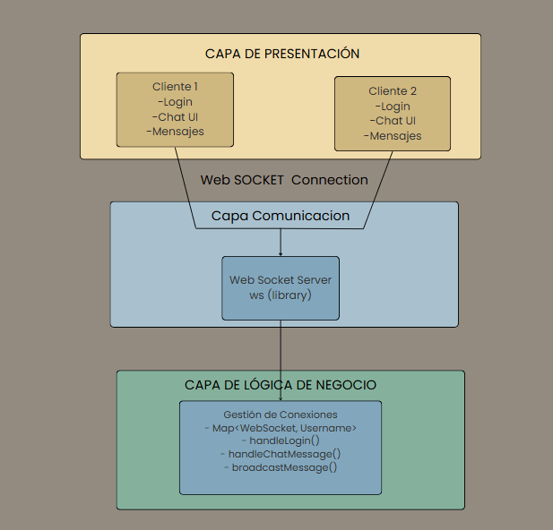
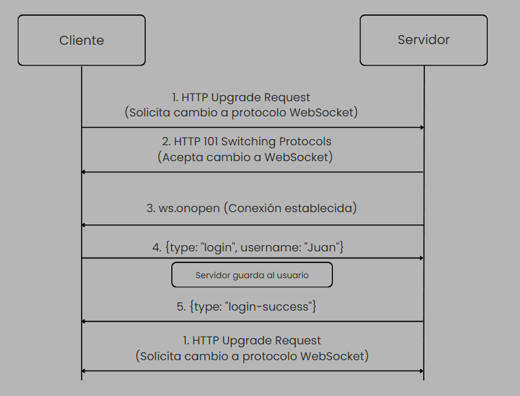
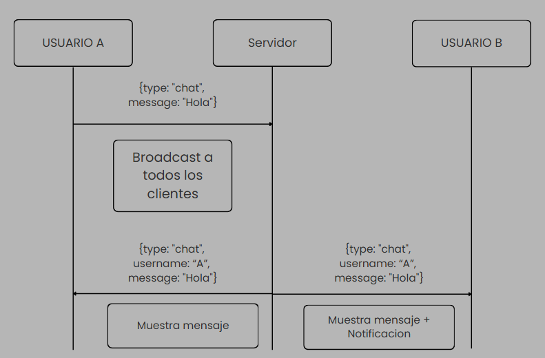
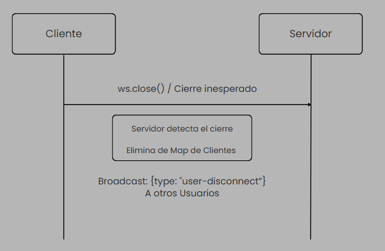
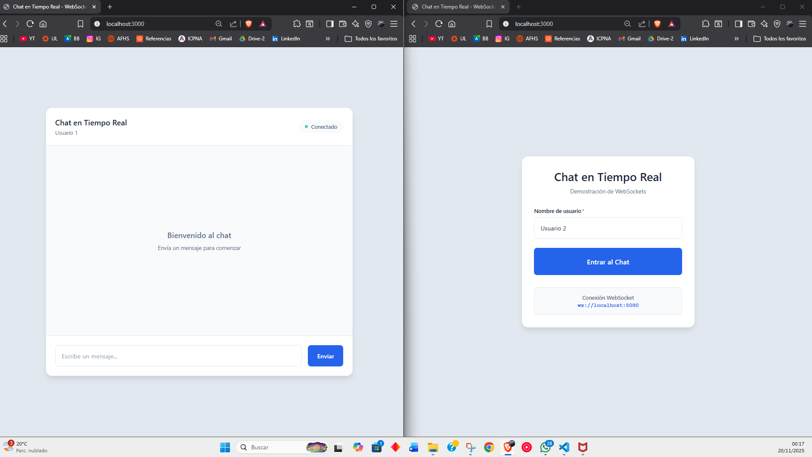
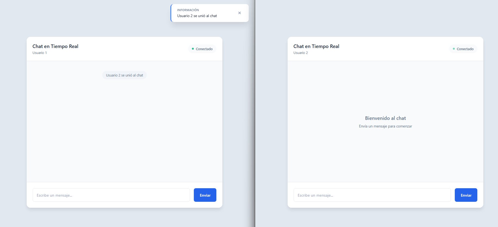
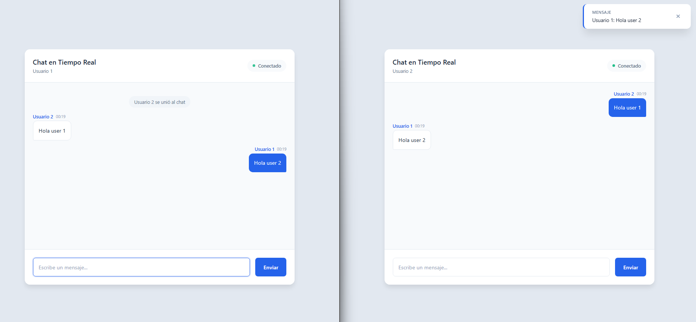
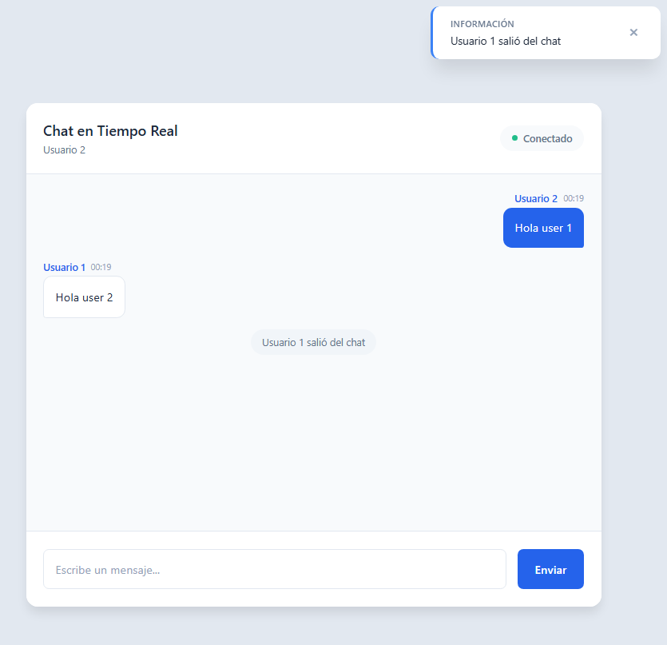

> [0. Acerca del Grupo](../../0.md) › [0.8. Temas Individuales (Parte 2)](../0.8.md) › [0.8.2. Integrante 2](0.8.2.md)

# 0.8.2. Integrante 2 - Alonso Almerco Velita

# Chat en Tiempo Real con WebSockets. 

Comunicación en Tiempo Real mediante WebSockets (Táctica Arquitectónica)


##  Desarrollo Conceptual

### ¿Qué es la Comunicación en Tiempo Real con WebSockets?

La comunicación en tiempo real mediante WebSockets es una táctica arquitectónica que permite establecer una conexión bidireccional y persistente entre el cliente y el servidor. A diferencia del modelo tradicional HTTP request-response, WebSockets mantiene un canal abierto que permite el envío y recepción de datos en cualquier momento.

**Características principales:**

- **Conexión persistente**: Una vez establecida, la conexión permanece abierta hasta que uno de los extremos la cierre.
- **Comunicación bidireccional**: Tanto el cliente como el servidor pueden iniciar el envío de mensajes.
- **Baja latencia**: Eliminación del overhead de crear nuevas conexiones HTTP para cada mensaje.
- **Eficiencia**: Reducción significativa del uso de ancho de banda comparado con técnicas de polling.

**Casos de uso típicos:**

- Aplicaciones de mensajería instantánea y chat
- Sistemas de notificaciones en tiempo real
- Dashboards con datos que se actualizan constantemente
- Juegos multijugador en línea
- Aplicaciones colaborativas (editores de texto, pizarras)
- Seguimiento de ubicación en tiempo real

---

## Objetivos del Proyecto

Este proyecto demuestra la implementación práctica de WebSockets para:

1. **Establecer comunicación bidireccional**: Cliente y servidor se comunican sin restricciones de dirección.
2. **Mantener conexiones persistentes**: Una sola conexión maneja todo el ciclo de vida de la sesión.
3. **Implementar broadcast eficiente**: Distribuir mensajes a múltiples clientes simultáneamente.
4. **Gestionar estados de conexión**: Manejar conexiones, desconexiones y errores de manera robusta.
5. **Demostrar uso sin abstracciones**: Implementación pura con librería `ws`, sin frameworks pesados.

---

## Arquitectura del Sistema

### Diagrama de Componentes




### Capas del Sistema

| Capa | Responsabilidad | Tecnología | Componentes |
|------|----------------|------------|-------------|
| **Presentación** | Interfaz de usuario y experiencia | React + Vite | Login, Chat, Mensajes, Notificaciones |
| **Comunicación** | Protocolo WebSocket | WebSocket API / ws | Conexión bidireccional persistente |
| **Lógica de Negocio** | Gestión de usuarios y mensajes | Node.js | Autenticación, Broadcasting, Estado |

---

## Flujo de Comunicación WebSocket

### 1. Establecimiento de Conexión




### 2. Intercambio de Mensajes (Broadcasting)




### 3. Desconexión




---

## Tecnologías Utilizadas

| Componente | Tecnología | Versión | Propósito |
|------------|------------|---------|-----------|
| **Frontend Framework** | React | 18.2.0 | Construcción de interfaz de usuario |
| **Build Tool** | Vite | 5.0.8 | Empaquetado y desarrollo rápido |
| **Backend Runtime** | Node.js | 18+ | Ejecución del servidor |
| **WebSocket Library** | ws | 8.14.2 | Implementación del protocolo WebSocket |
| **Estilos** | CSS Custom Properties | - | Variables de diseño y tematización |

---

## Guía de Instalación y Ejecución

### 1. Requisitos Previos

Antes de comenzar, asegúrate de tener instalado:

- **Node.js** 
  - Verifica la instalación:
    ```powershell
    node -v
    npm -v
    ```

### 2. Clonar o Descargar el Proyecto

```powershell
cd C:\ruta\a\tu\proyecto\WebSocket
```

### 3. Instalación de Dependencias

#### Backend (Servidor WebSocket)

```powershell
cd backend

# Instalar dependencias
npm install
# - ws@^8.14.2 (librería WebSocket)
```

#### Frontend (Aplicación React)

```powershell
# Navegar a la carpeta del frontend
cd ..\frontend

# Instalar dependencias
npm install

```

### 4. Estructura de Carpetas del Proyecto

```
WebSocket/
│
├── backend/                    # Servidor WebSocket
│   ├── server.js              # Lógica principal del servidor
│   ├── package.json           # Dependencias del backend
│   └── .gitignore
│
├── frontend/                   # Aplicación React
│   ├── src/
│   │   ├── components/
│   │   │   ├── common/        # Componentes reutilizables
│   │   │   │   ├── Button.jsx
│   │   │   │   ├── Input.jsx
│   │   │   │   └── Card.jsx
│   │   │   ├── chat/          # Componentes del chat
│   │   │   │   ├── ChatHeader.jsx
│   │   │   │   └── Message.jsx
│   │   │   ├── Login.jsx      # Pantalla de login
│   │   │   ├── Chat.jsx       # Pantalla principal del chat
│   │   │   └── Notification.jsx
│   │   ├── utils/
│   │   │   └── dateUtils.js   # Utilidades de fecha
│   │   ├── styles/
│   │   │   └── theme.css      # Variables CSS globales
│   │   ├── App.jsx            # Componente raíz
│   │   ├── main.jsx           # Punto de entrada
│   │   └── index.css          # Estilos globales
│   ├── index.html
│   ├── vite.config.js         # Configuración de Vite
│   ├── package.json
│   └── .gitignore
│
└── README.md                   # Este archivo
```

### 5. Ejecutar el Servidor Backend

Abre una terminal (PowerShell o CMD) y ejecuta:

```powershell
cd backend
npm start
```

**Salida esperada:**
```
[Server] WebSocket server running on ws://localhost:8080
```

El servidor ahora está escuchando conexiones WebSocket en el puerto **8080**.

### 6. Ejecutar el Cliente Frontend

Abre **otra terminal** (mantén la del backend abierta) y ejecuta:

```powershell
cd frontend
npm run dev
```

### 7. Acceder a la Aplicación

Abre tu navegador y visita:

```
http://localhost:3000
```

### 8. Probar la Comunicación en Tiempo Real

Para demostrar la funcionalidad completa del chat:

1. **Abre dos navegadores diferentes** (o dos ventanas en modo incógnito)
2. En ambos, navega a `http://localhost:3000`
3. **Usuario 1**: Ingresa un nombre y presiona "Entrar al Chat"
4. **Usuario 2**: Ingresa otro nombre y presiona "Entrar al Chat"
5. Observa cómo ambos reciben notificaciones de conexión
6. Envía mensajes desde cualquier usuario
7. Verifica que:
   - Los mensajes aparecen instantáneamente en ambas ventanas
   - Las notificaciones se muestran cuando llega un mensaje de otro usuario
   - Los mensajes propios se muestran a la derecha, los ajenos a la izquierda
### 1. Establecimiento de Conexión




### 2. Intercambio de Mensajes (Broadcasting)






### 3. Desconexión



---


## Consideraciones Técnicas

### Implementación del Backend

El servidor backend utiliza la librería `ws` que implementa el protocolo WebSocket (RFC 6455):

**Características clave:**

- **Gestión de estado**: Utiliza un `Map<WebSocket, string>` para mantener la asociación entre conexiones y usuarios
- **Broadcasting**: Función centralizada que distribuye mensajes a todos los clientes conectados
- **Event-driven**: Responde a eventos de conexión, mensaje, error y cierre
- **Sin estado en memoria volátil**: Los mensajes no se persisten, solo se transmiten en tiempo real

## Codigo
Link del repositorio de github: https://github.com/ulima-arqsoft/arqui252-alonso-almerco.git

Titulo del proyecto: WebSocket

---

[⬅️ Anterior](../0.8.1/0.8.1.md) | [🏠 Home](../../../README.md) | [Siguiente ➡️](../0.8.3/0.8.3.md)