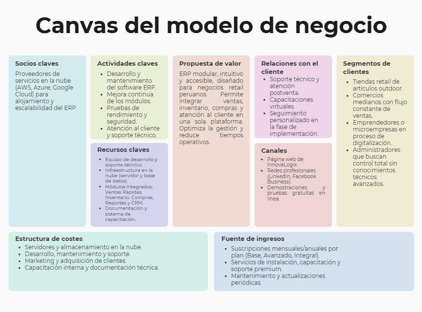

# 1.2. Modelo de Negocio

## Modelo de Negocio – InnovaLogix Retail ERP

InnovaLogix Retail ERP adopta un modelo SaaS modular (Software como Servicio), diseñado para negocios retail que buscan digitalizar su gestión sin depender de infraestructura física ni instalaciones complejas.
El sistema se ofrece con niveles de servicio escalables, donde cada plan incluye un conjunto de módulos según las necesidades del cliente.

### Plan Base (Empresarial Inicial – S/ 69 mensual)

Enfocado en negocios pequeños o medianos que requieren control operativo esencial.
Incluye:

- Módulo de Ventas Rápidas: registro ágil de transacciones, impresión de comprobantes y búsqueda inteligente de productos.
- Módulo de Inventario: control de stock, kardex y alertas de reposición.
- Reportes básicos de ventas e inventario.
- Ideal para tiendas minoristas o locales con alta rotación de productos, que necesitan rapidez y trazabilidad sin procesos complejos.

### Plan Avanzado (Retail Profesional – S/ 109 mensual)

Pensado para negocios con flujo constante de productos y múltiples proveedores.
Incluye todo el Plan Base más:

- Módulo de Compras: registro detallado de adquisiciones, actualización automática del inventario, historial de proveedores y comparativo de precios.
- Reportes de rentabilidad y desempeño por temporada.
- Dirigido a empresas que buscan optimizar la gestión de compras y mantener equilibrio entre oferta y demanda.

### Plan Integral (Retail Plus – S/ 149 mensual)

Diseñado para empresas que desean fortalecer su relación con los clientes y tomar decisiones basadas en datos.
Incluye todos los módulos del sistema:

- Ventas Rápidas + Inventario + Compras + Reportes + CRM y Atención al Cliente.
- Segmentación de clientes, programa de fidelización y panel de seguimiento postventa.
- Exportación avanzada de reportes (PDF, Excel).
- Capacitación inicial y soporte técnico prioritario.

Este plan ofrece una visión 360° del negocio, desde la operación diaria hasta el análisis estratégico de ventas y relaciones con los clientes.

### Modelo Económico:

- Tipo: SaaS B2B (empresa a empresa).
- Ingresos: suscripciones mensuales/anuales por plan.
- Estrategia: ofrecer adopción inicial accesible y escalabilidad modular.
- Ventaja competitiva: sistema especializado en retail de artículos outdoor, con módulos integrados y optimizados para escenarios de alta rotación (campamentos, ferias, temporadas).

