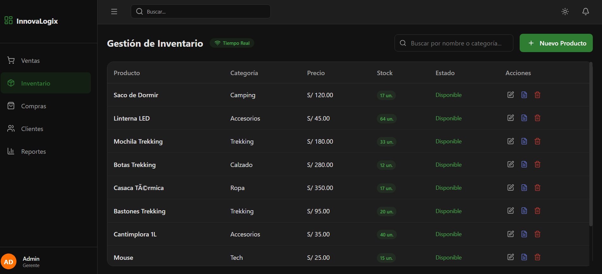
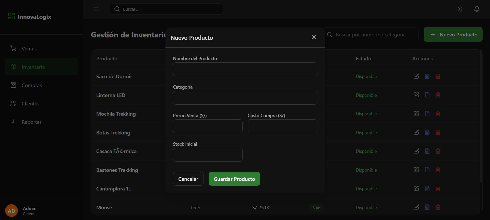
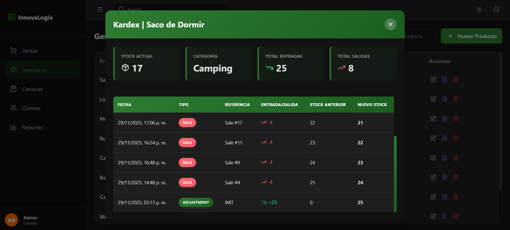
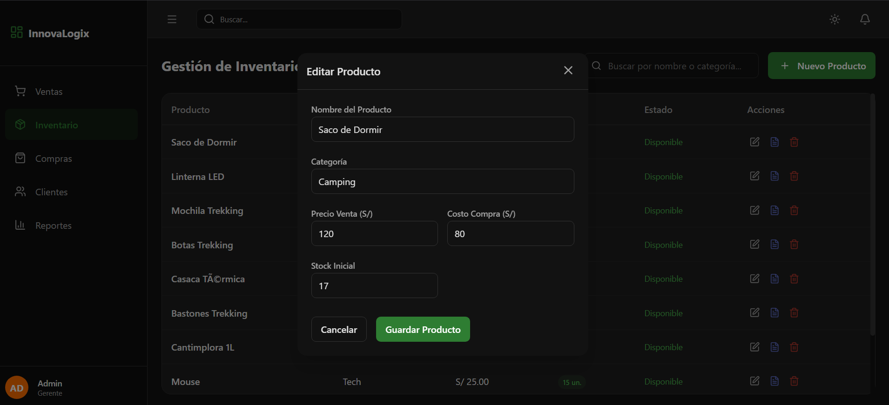
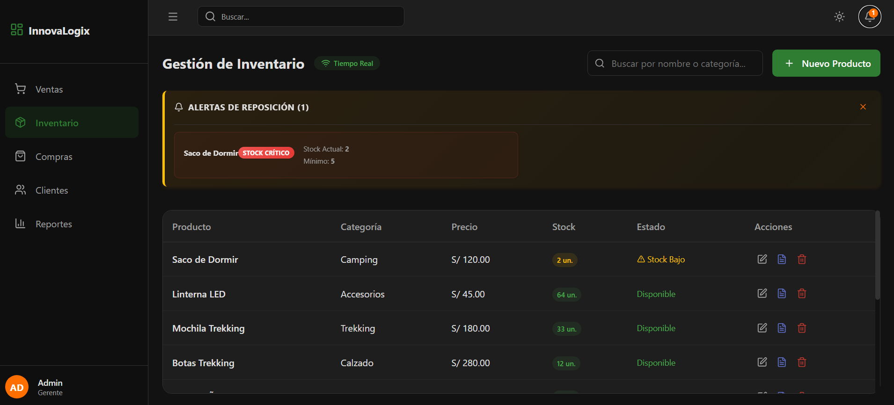

# 2.1.2. Módulo 2 - Alonso Almerco

Módulo de Inventario 
| ID   | Nombre                           | Historia de Usuario                                                                                                                                        |
| ---- | -------------------------------- | ---------------------------------------------------------------------------------------------------------------------------------------------------------- |
| RF7  | Registro de productos            | Como encargado de almacén, quiero registrar productos y sus variantes (talla, color, capacidad), para mantener un inventario detallado y actualizado.      |
| RF8  | Alertas de stock mínimo          | Como encargado de almacén, quiero recibir notificaciones cuando un producto clave esté bajo stock, para prevenir faltantes durante temporadas críticas.    |
| RF9  | Kardex de movimientos            | Como encargado de almacén, quiero ver un historial de entradas y salidas de productos con fechas y responsables, para mantener trazabilidad de inventario. |
| RF10 | Gestión de precios por temporada | Como gerente, quiero actualizar precios según promociones o liquidaciones, para ajustar la rentabilidad de manera flexible.                                |
| RF11 | Control de ubicaciones           | Como encargado de almacén, quiero conocer el stock por ubicación física, para optimizar la distribución en almacenes o exhibiciones.                       |

